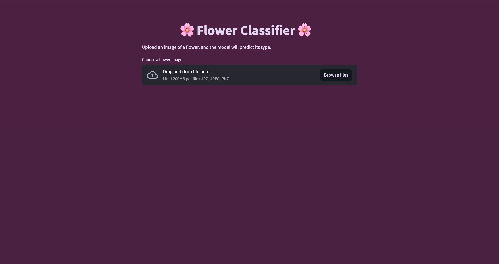
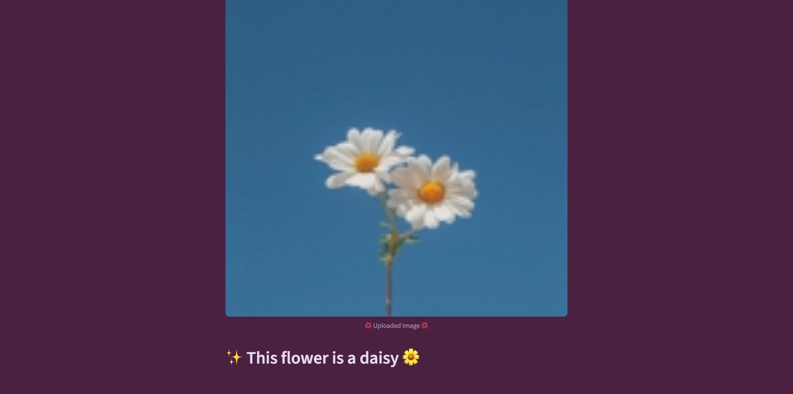

# Flower Classifier 

A deep learning project that classifies flowers into **5 categories**:  
**Daisy, Dandelion, Rose, Sunflower, Tulip** 🌼🌻🌹🌷  

This project uses **TensorFlow + Keras** for training and **Streamlit** for a interactive UI 

---

## Features  
- Upload any flower image (`.jpg`, `.jpeg`, `.png`)  
- Pretrained CNN model (`cnn_model.keras`) for flower classification  
- Dark lavender themed Streamlit UI 🌙  
- Real-time predictions 

---

## 📸 Preview  

  
  &nbsp;&nbsp;
  

---
